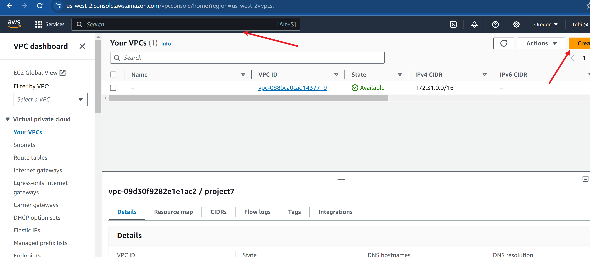

# Understand VPC Requirements
As a DevOps engineer, you need to understand the VPC requirements by asking questions to the relevant teams.

When working in real projects, following are some of the important questions that will help you understand the VPC requirements better.

1. Identifying Your Hosting Needs: What do you want to host?
2. Meeting Compliance Standards: What are its compliance requirements?
3. Handling Sensitive Information: Does it have applications dealing with PCI/PII data?
4. Public vs. Private Accessibility: Are the applications internet-facing?
5. Connecting to On-Premise Systems: Does the VPC require a Hybrid connectivity to an on-premise environment? If yes, is it DNS or IP-based connectivity?
6. User Accessibility to VPC Services: How are users going to connect to the services hosted in VPC?
7. VPC to VPC Connectivity: Does it need access to services hosted on other VPCs that are part of organizations network?
It is always best to document these requirements.

Note: Organizations typically keep a questionnaire to understand the VPC requirements from network, security, and compliance perspectives.

## Infrastructure Architecture
To design a VPC, the first thing you should have is an application and its infrastructure requirements.

We will take an example of an application and its requirements to design the VPC Network

Below is the architecture of our application’s infrastructure.

Tobe DESIGNED ARCHITECTURE??

## In the given architecture, there are four categories of applications.

1. Web Application (Java App)
2. Automation Tools (App/Infra CI/CD)
3. Platform Tools (Prometheus, Grafana etc)
4. Managed Services

### Web Application
Web applications are actively developed by the development team. In our case, it is an application publicly available for end-users.

### Automation Tools
CI/CD tools are essential in every project that involves applications.

### Platform Tools
Next, we have platform tools such as Prometheus, Grafana, and Consul that will be used for monitoring and service discovery purposes

### Managed Services
We are using the RDS MySQL service for our Database requirement. It is a managed database service.

For logging, we use CloudWatch. For DNS management we use Route 53.

# VPC Network Design
Ideally in most organizations the VPC is created and managed by a dedicated Network team. However, devops engineers working with the application team need to come up with the VPC requirements that can host all the required applications.

### How to choose CIDR for VPC?
The CIDR block for a VPC depends on the number of servers we plan to deploy in a VPC. This includes both self-hosted and AWS-managed services

We not only consider the immediate requirements but also the future expansion. We might start with a total of 15 servers now and in the future, it might grow to 1000+ servers.

So for our requirement, 10.0.0.0/20 CIDR is more than enough. Which would give you 4,096 usable IP addresses. We also need to factor on subnets in different availability zones.

However, for the project, we will choose the 10.0.0.0/16 CIDR range for our VPC. This will allow you up to 65,536 private IP addresses and it will make the subnetting easier.

Note: In actual project environments, VPC ranges are decided only based the requirements. Typically, the Application/DevOps/Network team will have a discussion and decide on the required ranges so that over/under allocation doesn’t happen

### Avoiding IP Address Conflicts
Let’s take a scenario where 10.0.0.0/16 range is already allocated to a project in an on-prem environment. Even if there is no hybrid cloud connectivity to on-prem, we should not re-use 10.0.0.0/16 for VPC. Because in the future, if hybrid connectivity is set up, it could lead to IP conflicts.

Network teams in organizations ensure there are no IP range conflicts by keeping track of private IP addresses reserved for projects. This way, there won’t be any IP conflicts. Typically they use IP Address Management (IPAM) tools to track IP address allocation. These tools provide a centralized view of the IP address space used within the organization.

The following image shows an example dashboard of an open-source IPAM tool called Netbox.


Note: If you use AWS Private NAT gateway you can avoid IP conflicts even if two VPCs have the same CIDR ranges.

## Subnet Design
Based on our application architecture and components we would need the following public and private subnets.

1. Public Subnets (Public): To deploy Load balancers for the Java app autoscaling group
2. Application Subnets (Private): To deploy the Java app autoscaling group
3. Database Subnets (Private): To deploy the RDS MYSQL instance
4. Management Subnets (Private): To deploy CI/CD tools and platform tools.
5. Platform Tools Subnets (Private): To deploy and manage all the platform tools.

## Private Subnet Access
Since we have private subnets, DevOps engineers & developers need access to the servers on private subnets.

Most organizations set up a VPN connection to the AWS cloud to access the servers deployed in VPC.

Following are the native-options for connecting instances in the AWS VPC private subnets.

1. EC2 Instance Connect: Helps you to connect to AWS instances in a private subnet securely without needing a Public IP. It is an identity-aware proxy that uses IAM permissions to connect to the instance. One instance can be used as a JUMP server to connect to other instances in the VPC (cheapest solution)
2. AWS Client VPN (client-to-site VPN): Allows remote workers to access AWS resources securely; Ideal for a distributed team that needs to use AWS services. (Gets expensive with more users)
3. Site-to-Site VPN: Connects the on-premises network to the AWS Virtual Private Cloud (VPC); This is the ideal solution for organizations that want a secure, private connection between their on-prem network and AWS. Requires an on-premises VPN device. Setup can be expensive.
4. AWS Direct Connect: Creates a direct, private link between the on-prem and AWS network; It is ideal for businesses that need a fast, reliable connection to AWS without using the public internet. It comes with a higher upfront costs.
Note: The type of access depends on the project requirements, compliance requirements, and budget.

## Internet Access
Both Private and Public subnet servers need internet access.

If you add an internet gateway, your subnet becomes a public subnet. Others by default become private.

Therefore, we need add a internet gateway to the public subnet for direct internet inbound access for instances in the public subnet.

Other subnets need to be in private. For the private subnets to access the internet (outbound), you need to attach a NAT gateway. This is primarily required to access thrid party services or package repositories available in internet.

## Egress Filtering
Most organizations use a forward proxy for all outbound internet requests from Private & public subnets. Meaning, that even though we have a NAT gateway, there would be a firewall service to filter the outbound traffic.

AWS offers a service called AWS Network Firewall, which can be integrated with a NAT gateway for egress traffic filtering. You can restrict or filter HTTP and HTTPS traffic using domain names.

Some organizations use self-managed Squid Proxies for DNS filtering. Big organizations use enterprise solutions like Checkpoint for ingress & egress filtering.

All outgoing requests first hit the proxy, get filtered, and then go out through the NAT gateway.

## VPC Documentation
One of the key things in VPC design is documentation. All VPC configurations should be documented to ensure the VPC stays compliant over time.

You can choose a documentation method of your choice. It could be an Excel sheet, confluence documentation, or GitHub Markdown documentation.

Now that we have a good understanding of the VPC requirements for our project, let’s document the required subnets and CIDRs.


# STEP 1

Let's create a VPC for our project and assign attach an internet gateway to it

- Login to your AWS management console and search VPC




- Now we create an Internet Gateway


We will follow the following subnet naming schemes
```
EnvName-AppType-RouteType-AZ
```
For example,
```
Prod-Web-Public-2a
```


Let's create some subnet

- Public Subnets

| Subnet Name          | Availability Zone | CIDR Block  | Type   |
|----------------------|-------------------|-------------|--------|
| Prod-Web-Public-2a   | us-west-2a        | 10.0.0.0/28  | Public |
| Prod-Web-Public-2b   | us-west-2b        | 10.0.0.16/28 | Public |
| Prod-Web-Public-2c   | us-west-2c        | 10.0.0.32/28 | Public |

- Application Subnets

| Subnet Name          | Availability Zone | CIDR Block  | Type    |
|----------------------|-------------------|-------------|---------|
| Prod-App-Private-2a  | us-west-2a        | 10.0.0.48/28 | Private |
| Prod-App-Private-2b  | us-west-2b        | 10.0.0.64/28 | Private |
| Prod-App-Private-2c  | us-west-2c        | 10.0.0.80/28 | Private |

- Database Subnets

| Subnet Name         | Availability Zone | CIDR Block  | Type    |
|---------------------|-------------------|-------------|---------|
| Prod-DB-Private-2a  | us-west-2a        | 10.0.0.96/28 | Private |
| Prod-DB-Private-2b  | us-west-2b        | 10.0.0.112/28 | Private |
| Prod-DB-Private-2c  | us-west-2c        | 10.0.0.128/28 | Private |

- Management Subnets

| Subnet Name           | Availability Zone | CIDR Block   | Type    |
|-----------------------|-------------------|--------------|---------|
| Prod-Mgmt-Private-2a  | us-west-2a        | 10.0.0.144/28 | Private |
| Prod-Mgmt-Private-2b  | us-west-2b        | 10.0.0.160/28 | Private |
| Prod-Mgmt-Private-2c  | us-west-2c        | 10.0.0.176/28 | Private |

- Platform Subnets

| Subnet Name              | Availability Zone | CIDR Block   | Type    |
|--------------------------|-------------------|--------------|---------|
| Prod-Platform-Private-2a | us-west-2a        | 10.0.0.192/28 | Private |
| Prod-Platform-Private-2b | us-west-2b        | 10.0.0.208/28 | Private |
| Prod-Platform-Private-2c | us-west-2c        | 10.0.0.224/28 | Private |


# Route Table Design
For each subnet group, we will create a custom route table and assign rules required for the specific subnets.

For example, all three public subnets will share the same public-subnet route table.

| Subnet      | Destination CIDR | Target           |
|-------------|------------------|------------------|
| Public      | 0.0.0.0/0        | Internet Gateway |
| App         | 0.0.0.0/0        | Nat Gateway      |
| DB          | 0.0.0.0/0        | Nat Gateway      |
| Management  | 0.0.0.0/0        | Nat Gateway      |


# AWS VPC Topology
The following diagram shows the high-level VPC topology for our design.

Note: Both the internet Gateway (IGW) and NAT gateway(NAT-GW) gets deployed in the public subnet.


# Network ACLs
Network access control list (NACL) is the native VPC functionality to control the inbound and outbound traffic at the subnet level.

In our architecture, the connection to the DB subnet should be allowed only from the App subnet and management subnet. The public subnet should not have direct access to the DB subnet.

The following are the tables for inbound and outbound rules for the DB NACL.

# DB NACL (Inbound Rules)